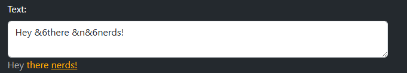

**TL;DR:** [Nerd Web](http://57.129.69.232/) is a new web interface for all gen2 commands with preview features, a cheat sheet, and more coming soon.

# Nerd Web (Beta)
Hello Nerds, today I'm happy to announce Nerd Web beta. A tool for using the bot with a web based interface.
This means: A less steep learning curve, quicker image generation, easier input editing, and a more user-friendly interface.
## Features
This website is still in beta and I will add more features down the road. 
Current Features:
- All the gen2 commands with a nice web interface:
    - Head Generator
    - Inventory Generator
    - Dialogue  Generators
        - Multi Dialogue Generator
        - Single Dialogue Generator
    - Recipe Generator
    - Text Generator
    - Tooltip Generator
- A Cheat Sheet that has:
    - Color codes
    - Format codes
    - Icons
    - Gemstones
    - Stats
- A realtime preview of what your text will look like on big text inputs before you start generating: 
 
- Share generator inputs feature
  - You can easily click a button and send the link to someone, and it will share the inputs you gave for a certain gen

Planned features:
- A generator history saved in the cookies.
- Keep input upon refresh (ties into the above.)

## Bugs
For bug reporting [create a new issue](https://github.com/SkyBlock-Nerds/NerdWeb/issues/new) in the repo.

## Website:
Ready to try it? Here you go: 
[NerdWeb Beta](http://57.129.69.232/) 
Currently it's not being run on a Domain name. I plan on later buying a domain and linking it to this website. 
This does however mean that it's "not secure". What does this mean? In the current state of the application, not much. The secure tag is mainly there to encrypt traffic between the website and the host. However, no sensitive information is being transmitted so it doesn't matter for now.

# Disclaimer:
**__This is my own project. It's being hosted by me.__** 
I am not a member of Hypixel staff and have no official affiliation with the Hypixel Network.

What does this mean?
- This website is maintained by me (@socks_m).
- Is it open source like the bot is?
    - Yes! If you want to view the code you can do so at [NerdWeb Repo](https://github.com/Skyblock-Nerds/NerdWeb/tree/dev)
- When will the website update?
    - I will update the website when I have time.
    - When I do change the code it doesn't mean that it will be live right away.
- Can I contribute? Yes! Any contributions are welcome.